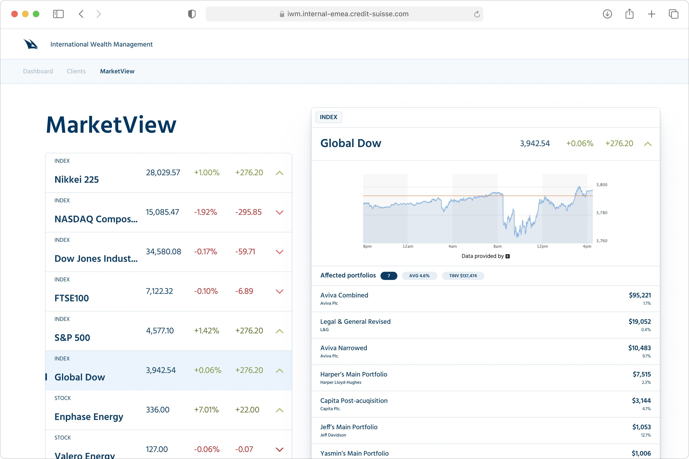
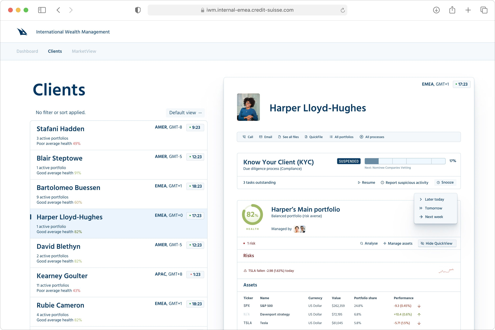
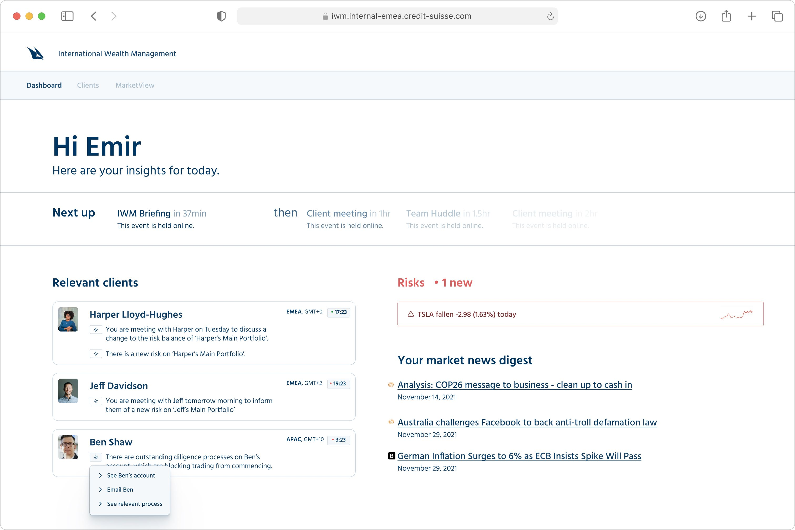

> Credit Suisse Group AG is a Swiss financial services firm and global investment bank.

Their International Wealth Management (IWM) division has over 160 years of financial expertise and by embracing technological innovation, they have become a leader in their industry.

IWM's relationship managers work with clients to develop their portfolios, manage risk and maintain a healthy relationship between them and the bank. For this project, they required a digital solution which gathered data from various legacy systems, and combined it into a modern, efficient, easy to use interface.
# Consultation and Planning

Following a consultation with the client, we decided that our solution, Credit Suisse One Step Assistant (OSA for short), would be best deployed as a responsive web application. The main audience for this product, Credit Suisse IWM's relationship managers, was often on the go and required a high degree of portability— a solution which would be compatible with a wide range of mobile devices.
        
By finding out about a relationship manager's workflow, we conceptualised an intelligent client summary page. This captured details about—
        
- The client's **contact details**
- **Legal requirements**— due diligence and compliance processes
- **Portfolio breakdown**— overview of investments

# Outcome

We made sure interfaces linked in with each other extensively, providing speed and ease of access to information for relationship managers. An example of this was in the MarketView tool which showed RMs the portfolios affected by a particular asset, ordered by size of investment.

The scope of the project included high-fidelity prototyping of the conceptualised solution. This was created in Figma and presented to the client. Early business case analyses showed that the final solution could have allowed Relationship Managers to take up on an additional 4 clients each, while saving the IWM division over 80 thousand pounds annually.

